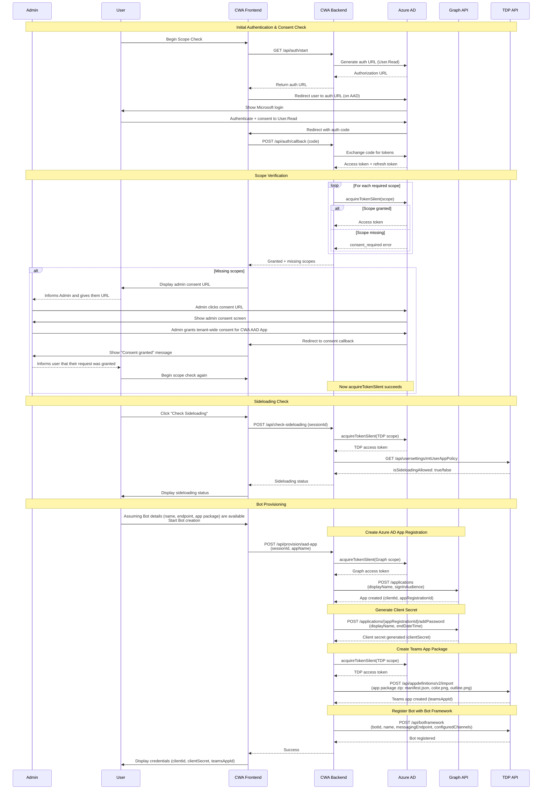

# Bot Provisioner - Technical Architecture

## System Participants

### CodeWriterApp (CWA)
CodeWriterApp is your application which will be used to provision bots built on your platform in another user's tenant. It consists of a backend server that talks to Microsoft's APIs and a frontend web interface where users interact. The app is registered in your Azure AD tenant as a multi-tenant application, which means it can work with users from any organization. It uses a confidential client flow - meaning the backend securely stores a client secret that never gets exposed to the browser.

### Azure AD (CWA Tenant)
The identity provider where CWA is registered as a multi-tenant application. Handles:
- OAuth authorization code flow for user authentication
- Token issuance for accessing Microsoft Graph and Teams Dev Portal
- Admin consent grants (tenant-wide permissions)

### User (User Tenant)
An end user from any Microsoft 365 tenant who wants to provision a bot. The user:
- Authenticates via OAuth to CWA
- Must have sufficient permissions to create apps in their tenant
- May need their tenant admin to grant consent for required permissions

### Admin (User Tenant)
A tenant administrator in the same tenant as the User. The admin:
- Has permissions to grant tenant-wide consent for applications
- Receives admin consent URL from User when permissions are needed
- Grants consent for CWA to access Graph and TDP APIs on behalf of users in their tenant

### Teams Developer Portal Backend (TDP)
Microsoft's backend service for Teams app management (`https://dev.teams.microsoft.com`). Provides APIs for:
- Creating Teams app definitions
- Registering bot endpoints
- Checking tenant sideloading status
- **Requires**: `AppDefinitions.ReadWrite` scope

### Microsoft Graph Backend
Microsoft's unified API endpoint (`https://graph.microsoft.com`). Provides APIs for:
- Creating Azure AD app registrations
- Generating client secrets
- Managing app permissions
- **Requires**: `Application.ReadWrite.All` scope

## Requirements for Bot Provisioning

For CWA to successfully provision a Teams bot for a user, the following conditions must be met:

### 1. User Authentication
- User must authenticate with CWA using OAuth 2.0 authorization code flow
- Minimum scope: `User.Read` (always grantable by user)

### 2. Admin Consent
The user's tenant admin must grant consent for these delegated permissions:
- **Graph API**: `Application.ReadWrite.All` - Create Azure AD apps and secrets
- **Teams Dev Portal**: `AppDefinitions.ReadWrite` - Create Teams apps and register bots

### 3. User Permissions
The authenticated user must have roles in their tenant allowing:
- Creating app registrations in Azure AD (typically requires Application Administrator role)
- Creating Teams apps via Developer Portal

### 4. Tenant Settings
- **Sideloading**: Tenant must allow custom app uploads (verifiable via TDP API)
- **App Registration**: Tenant must allow users to register applications (Azure AD setting)

### 5. Bot Endpoint
- User must provide an HTTPS endpoint where the bot will be hosted
- Endpoint must be accessible from Microsoft Teams infrastructure

## Provisioning Flow



## Key Technical Details

### Token Acquisition Strategy
CWA uses a two-phase token acquisition approach:

1. **Initial auth**: Request only `User.Read` scope - this always succeeds, allowing users to sign in even without admin consent
2. **Subsequent requests**: Use `acquireTokenSilent()` with cached refresh token to obtain tokens for admin-consented scopes

This pattern avoids blocking users at sign-in while clearly indicating which permissions are missing.

### Multi-Resource Token Management
The provisioning flow requires tokens for two different resource servers:
- **Microsoft Graph**: For Azure AD app management
- **Teams Dev Portal**: For Teams app and bot management

Azure AD does not allow requesting scopes from multiple resources in a single auth request. CWA handles this by:
- Authenticating once with `User.Read`
- Using the cached refresh token to silently acquire tokens for each resource as needed

### Error Handling
When `acquireTokenSilent()` fails, CWA distinguishes between:
- **Expected**: `consent_required`, `interaction_required`, `invalid_grant` with AADSTS65001 → Show admin consent URL
- **Unexpected**: Network errors, token expiration, unknown errors → Return error to user

## Setting up the CWA App on Azure

To enable CWA to provision bots for users across different tenants, you must register it as a multi-tenant application in your Azure AD tenant.

### 1. Register Multi-Tenant Application
- Sign in to the [Azure Portal](https://portal.azure.com)
- Navigate to **Azure Active Directory** > **App registrations** > **New registration**
- Configure:
  - **Name**: Choose a descriptive name (e.g., "Bot Provisioner")
  - **Supported account types**: Select **Accounts in any organizational directory (Any Azure AD directory - Multitenant)**
  - **Redirect URI**: Leave blank for now (will configure next)

### 2. Configure Redirect URIs
After registration, add redirect URIs for OAuth flows:
- Navigate to **Authentication** > **Add a platform** > **Web**
- Add two redirect URIs:
  - **OAuth callback**: `https://your-app-domain.com/redirect.html` (handles OAuth authorization code)
  - **Admin consent callback**: `https://your-app-domain.com/admin-consent-callback.html` (handles admin consent redirect)

### 3. Generate Client Secret
- Navigate to **Certificates & secrets** > **New client secret**
- Add description and select expiration period
- **Important**: Copy the secret value immediately - it won't be shown again
- Store securely (e.g., Azure Key Vault, environment variable)

### 4. Configure API Permissions
Add the required delegated permissions:

**Microsoft Graph**:
- Navigate to **API permissions** > **Add a permission** > **Microsoft Graph** > **Delegated permissions**
- Add: `Application.ReadWrite.All`

**Teams Developer Portal**:
- **Add a permission** > **APIs my organization uses** > Search for "Teams Developer Portal" or use App ID: `1fec8e78-bce4-4aaf-ab1b-5451cc387264`
- **Delegated permissions** > Add: `AppDefinitions.ReadWrite`

**Note**: These permissions will be granted per-tenant via admin consent flow. You don't need to grant them in the CWA tenant.

### 5. Note Configuration Values
Save these values for your backend configuration:
- **Application (client) ID**: Found on the app registration overview page
- **Client Secret**: Generated in step 3
- **Tenant ID**: Your CWA tenant ID (for reference, though using `/common` endpoint)

## Backend Implementation Requirements

The backend must implement the following capabilities:

### 1. Authentication & Authorization
- **Start OAuth Flow**: Generate Azure AD authorization URL with `User.Read` scope
- **Handle OAuth Callback**: Exchange authorization code for access token and refresh token
- **Token Management**: Store user account information to enable silent token acquisition

### 2. Checking Scopes
Verify if admin consent has been granted for required permissions:
- Attempt to acquire tokens silently for each required scope:
  - `https://graph.microsoft.com/Application.ReadWrite.All`
  - `https://dev.teams.microsoft.com/AppDefinitions.ReadWrite`
- Distinguish between expected consent errors and unexpected failures
- Return list of granted scopes and missing scopes to frontend
- Generate admin consent URL when scopes are missing

### 3. Check Sideloading
Verify tenant allows custom app uploads:
- Acquire token for TDP scope
- Call TDP API: `GET https://dev.teams.microsoft.com/api/usersettings/mtUserAppPolicy`
- Parse response for `isSideloadingAllowed` boolean value
- Return sideloading status to frontend

### 4. Provisioning Endpoints
Implement the complete bot provisioning flow:

**Create Azure AD App Registration**:
- Acquire token for Graph scope
- Call: `POST https://graph.microsoft.com/v1.0/applications`
- Body: `{ "displayName": "...", "signInAudience": "AzureADMultipleOrgs" }`
- Return: `clientId` and `appRegistrationId` (objectId)

**Generate Client Secret**:
- Call: `POST https://graph.microsoft.com/v1.0/applications/{appRegistrationId}/addPassword`
- Body: `{ "passwordCredential": { "displayName": "...", "endDateTime": "..." } }`
- Return: `clientSecret` value

**Create Teams App Package**:
- Acquire token for TDP scope
- Create zip file containing: `manifest.json`, `color.png`, `outline.png`
- Call: `POST https://dev.teams.microsoft.com/api/appdefinitions/v2/import`
- Headers: `Content-Type: application/zip`
- Return: `teamsAppId`

**Register Bot**:
- Call: `POST https://dev.teams.microsoft.com/api/botframework`
- Body: `{ "botId": "...", "name": "...", "messagingEndpoint": "...", "configuredChannels": ["msteams"], "isSingleTenant": true }`
- Handle 409 conflict (bot exists) by updating instead
- Return: Success status

## Frontend Implementation Requirements

The frontend must provide the user interface for the entire provisioning workflow:

### 1. OAuth Redirect Handling
- Capture authorization code from URL query parameters after Azure AD redirect
- Send code to backend for token exchange
- Store session identifier for subsequent API calls
- Handle authentication errors and display to user

### 2. Consent Checking UI
- Trigger scope verification via backend
- Display list of granted permissions
- Show clear indication when all required scopes are granted
- Enable provisioning workflow only after consent is verified

### 3. Admin Consent Flow
When scopes are missing:
- Display admin consent URL prominently
- Provide clear instructions for User to share URL with Admin
- Show admin consent callback page confirming successful consent
- Allow user to re-check scopes after admin grants consent

### 4. Sideloading Check
- Provide button/action to check tenant sideloading status
- Display clear enabled/disabled status
- If disabled, show guidance to contact tenant administrator

### 5. Bot Provisioning Form
Collect required information from user:
- **Bot Name**: Display name for the bot
- **Bot Endpoint**: HTTPS URL where bot will be hosted (with `/api/messages` path)
- **App Package Details**: Information needed for Teams manifest (app ID, descriptions, icons, etc.)

### 6. Post-Provisioning Display
After successful provisioning, display the generated credentials:
- `BOT_ID` (clientId)
- `BOT_PASSWORD` (clientSecret)
- `TEAMS_APP_ID` (teamsAppId)
- `TENANT_ID` (user's tenant ID)

Provide clear guidance for:
- Setting these values in `.env` file or environment variables
- Securing the client secret
- Next steps for bot development

### 7. Teams Installation Deep Link
Generate and display the Teams app installation URL:
```
https://teams.microsoft.com/l/app/{teamsAppId}?installAppPackage=true&webjoin=true&appTenantId={tenantId}&login_hint={userPrincipalName}
```

This link allows the user to directly install the provisioned bot in Microsoft Teams.
