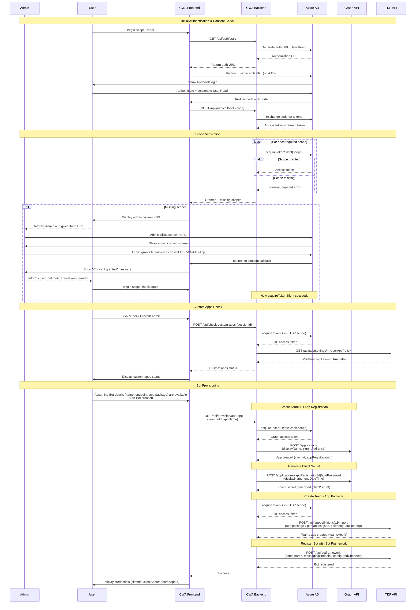

# Bot Provisioner - Technical Architecture

## System Participants

### CodeWriterApp (CWA)
CodeWriterApp is your application which will be used to provision bots built on your platform in another user's tenant. It consists of a backend server that talks to Microsoft's APIs and a frontend web interface where users interact. The app is registered in your Azure AD tenant as a multi-tenant application, which means it can work with users from any organization. It uses a confidential client flow - meaning the backend securely stores a client secret that never gets exposed to the browser.

### CWA Azure AD Registration
All apps in Azure need to be registered with Azure AD. Registration gives your app the ability to use OAuth for user authentication and access other services on the user's behalf. For CWA, you'll need access to Microsoft Graph and Teams Developer Portal APIs. Here's the important part: because your app uses sensitive permissions (like installing apps in Teams), admins from your users' organizations will need to approve these permissions before your app can use them in their tenant.

### User (User Tenant)
An end user from any Microsoft 365 tenant who wants to provision a bot. The user:
- Authenticates via OAuth to CWA
- Must have sufficient permissions to create apps in their tenant
- May need their tenant admin to grant consent for required permissions

### Admin (User Tenant)
A tenant administrator in the same tenant as the User. The admin:
- Has permissions to grant tenant-wide consent for applications
- Receives admin consent URL from User when permissions are needed
- Grants consent for CWA to access Graph and TDP APIs on behalf of users in their tenant
- Can enable custom apps in Teams (disabled by default in most tenants)

### Teams Developer Portal Backend (TDP)
Microsoft's backend service for Teams app management (`https://dev.teams.microsoft.com`). Provides APIs for:
- Creating Teams app definitions
- Registering bot endpoints
- Checking if custom apps are enabled in the tenant
- **Requires**: `AppDefinitions.ReadWrite` scope

### Microsoft Graph Backend
Microsoft's unified API endpoint (`https://graph.microsoft.com`). Provides APIs for:
- Creating Azure AD app registrations
- Generating client secrets
- Managing app permissions
- **Requires**: `Application.ReadWrite.All` scope

## Requirements for Bot Provisioning

For CWA to successfully provision a Teams bot for a user, the following conditions must be met:

- Admin must grant consent to enable your CWA application to work in their tenant
- Admin must enable custom Teams applications
- User must authenticate to your application
- CWA must provide a reachable HTTPS endpoint where the bot will be hosted
- CWA must provide the metadata needed for a Teams application (name, descriptions, icons, etc.)

## Provisioning Flow



## Key Technical Details

### Token Acquisition Strategy
CWA uses a two-phase token acquisition approach:

1. **Initial auth**: Request only `User.Read` scope - this always succeeds, allowing users to sign in even without admin consent
2. **Subsequent requests**: Use `acquireTokenSilent()` with cached refresh token to obtain tokens for admin-consented scopes

This pattern avoids blocking users at sign-in while clearly indicating which permissions are missing.

### Multi-Resource Token Management
The provisioning flow requires tokens for two different resource servers:
- **Microsoft Graph**: For Azure AD app management
- **Teams Dev Portal**: For Teams app and bot management

Azure AD does not allow requesting scopes from multiple resources in a single auth request. CWA handles this by:
- Authenticating once with `User.Read`
- Using the cached refresh token to silently acquire tokens for each resource as needed

### Error Handling
When `acquireTokenSilent()` fails, CWA distinguishes between:
- **Expected**: `consent_required`, `interaction_required`, `invalid_grant` with AADSTS65001 → Show admin consent URL
- **Unexpected**: Network errors, token expiration, unknown errors → Return error to user

### Admin Consent Flow
When your application determines that the admin has not consented to allow the app to run in the user's tenant, you should provide the user with an admin consent URL. The user is responsible for sending this URL to their admin along with any justification for why the app needs these permissions. This communication happens out of band.

## Setting up the CWA App on Azure

To enable CWA to provision bots for users across different tenants, you must register it as a multi-tenant application in your Azure AD tenant.

### 1. Register Multi-Tenant Application
- Sign in to the [Azure Portal](https://portal.azure.com)
- Navigate to **Azure Active Directory** > **App registrations** > **New registration**
- Configure:
  - **Name**: Choose a descriptive name (this is what users and admins will see during OAuth and consent flows)
  - **Supported account types**: Select **Accounts in any organizational directory (Any Azure AD directory - Multitenant)**
  - **Redirect URI**: Leave blank for now (will configure next)

### 2. Configure Redirect URIs
After registration, add redirect URIs for OAuth flows:
- Navigate to **Authentication** > **Add a platform** > **Web**
- Add two redirect URIs:
  - **OAuth callback**: This is where the user is redirected after authenticating (typically when building the app on your platform). Your page receives the authorization code and state parameters that need to be sent back to your server performing the bot provisioning work.
  - **Admin consent callback**: This is where the admin is redirected after approving your application to be used in their tenant. Show a friendly message confirming consent was granted. You may also want to include instructions for enabling custom apps: https://learn.microsoft.com/en-us/microsoftteams/teams-custom-app-policies-and-settings#allow-users-to-upload-custom-apps

### 3. Generate Client Secret
- Navigate to **Certificates & secrets** > **New client secret**
- Add description and select expiration period
- **Important**: Copy the secret value immediately - it won't be shown again
- Store securely (e.g., Azure Key Vault, environment variable)

### 4. Configure API Permissions
Add the required delegated permissions:

**Microsoft Graph**:
- Navigate to **API permissions** > **Add a permission** > **Microsoft Graph** > **Delegated permissions**
- Add: `Application.ReadWrite.All`

**Teams Developer Portal**:
- **Add a permission** > **APIs my organization uses** > Search for "App Studio for Microsoft Teams"
- **Delegated permissions** > Add: `AppDefinitions.ReadWrite`

**Note**: These permissions will be granted per-tenant via admin consent flow. You don't need to grant them in the CWA tenant.

### 5. Note Configuration Values
Save these values for your backend configuration:
- **Application (client) ID**: Found on the app registration overview page
- **Client Secret**: Generated in step 3

## Backend Implementation Requirements

The backend must implement the following capabilities:

### 1. Authentication & Authorization
Handle OAuth authorization code flow to authenticate users. Generate authorization URLs, exchange codes for tokens, and manage user sessions.

<details>
<summary>Technical Details</summary>

- **Start OAuth Flow**: Generate Azure AD authorization URL with `User.Read` scope
- **Handle OAuth Callback**: Exchange authorization code for access token and refresh token
- **Token Management**: Store user account information to enable silent token acquisition
</details>

### 2. Checking Scopes
Verify if the admin has granted the required permissions for your application. Distinguish between missing consent and other errors, and provide admin consent URLs when needed.

<details>
<summary>Technical Details</summary>

Verify if admin consent has been granted for required permissions:
- Attempt to acquire tokens silently for each required scope:
  - `https://graph.microsoft.com/Application.ReadWrite.All`
  - `https://dev.teams.microsoft.com/AppDefinitions.ReadWrite`
- Distinguish between expected consent errors and unexpected failures
- Return list of granted scopes and missing scopes to frontend
- Generate admin consent URL when scopes are missing
</details>

### 3. Check Custom Apps
Check if the user's tenant allows custom Teams apps to be uploaded. Return the status to the frontend.

<details>
<summary>Technical Details</summary>

Verify tenant allows custom app uploads:
- Acquire token for TDP scope
- Call TDP API: `GET https://dev.teams.microsoft.com/api/usersettings/mtUserAppPolicy`
- Parse response for `isSideloadingAllowed` boolean value
- Return custom apps status to frontend
</details>

### 4. Provisioning Endpoints
Implement the bot provisioning workflow by calling Microsoft Graph and Teams Developer Portal APIs to:
- Create an Azure AD app registration
- Generate a client secret for the app
- Create and upload a Teams app package
- Register the bot with Bot Framework

<details>
<summary>Technical Details</summary>

**Create Azure AD App Registration**:
- Acquire token for Graph scope
- Call: `POST https://graph.microsoft.com/v1.0/applications`
- Body: `{ "displayName": "...", "signInAudience": "AzureADMultipleOrgs" }`
- Return: `clientId` and `appRegistrationId` (objectId)

**Generate Client Secret**:
- Call: `POST https://graph.microsoft.com/v1.0/applications/{appRegistrationId}/addPassword`
- Body: `{ "passwordCredential": { "displayName": "...", "endDateTime": "..." } }`
- Return: `clientSecret` value

**Create Teams App Package**:
- Acquire token for TDP scope
- Create zip file containing: `manifest.json`, `color.png`, `outline.png`
- Call: `POST https://dev.teams.microsoft.com/api/appdefinitions/v2/import`
- Headers: `Content-Type: application/zip`
- Return: `teamsAppId`

**Register Bot**:
- Call: `POST https://dev.teams.microsoft.com/api/botframework`
- Body: `{ "botId": "...", "name": "...", "messagingEndpoint": "...", "configuredChannels": ["msteams"], "isSingleTenant": true }`
- Handle 409 conflict (bot exists) by updating instead
- Return: Success status
</details>

## Frontend Implementation Requirements

The frontend must provide the user interface for the entire provisioning workflow:

### 1. OAuth Redirect Page
Handle the OAuth callback after user authentication. Capture the authorization code and state from the URL, exchange them with your backend for a session, and redirect back to the main application.

<details>
<summary>Technical Details</summary>

- Capture authorization code from URL query parameters after Azure AD redirect
- Send code to backend for token exchange
- Store session identifier for subsequent API calls
- Handle authentication errors and display to user
</details>

### 2. Admin Consent Redirect Page
Handle the admin consent callback after an admin grants permissions. Display a confirmation message that consent was granted. Optionally include helpful information like instructions for enabling custom apps.

<details>
<summary>Technical Details</summary>

When scopes are missing:
- Display admin consent URL prominently
- Provide clear instructions for User to share URL with Admin
- Show admin consent callback page confirming successful consent
- Allow user to re-check scopes after admin grants consent
</details>

### 3. User Interface
Provide clear, helpful UI to guide users through the provisioning process. Show authentication status, permission checks, and provisioning progress.

<details>
<summary>Technical Details</summary>

- Trigger scope verification via backend
- Display list of granted permissions
- Show clear indication when all required scopes are granted
- Enable provisioning workflow only after consent is verified

**Bot Provisioning Form** - Collect required information from user:
- **Bot Name**: Display name for the bot
- **Bot Endpoint**: HTTPS URL where bot will be hosted (with `/api/messages` path)
- **App Package Details**: Information needed for Teams manifest (app ID, descriptions, icons, etc.)
</details>

### 4. Admin Consent Handling
When required permissions are missing, display the admin consent URL prominently with clear instructions for the user to share with their administrator. Show which permissions are missing and why they're needed.

### 5. Custom Apps Check
Check if custom apps are enabled in the user's tenant. If disabled, show helpful guidance and instructions for the user to share with their administrator to enable it.

<details>
<summary>Technical Details</summary>

- Provide button/action to check if custom apps are enabled in the tenant
- Display clear enabled/disabled status
- If disabled, show guidance to contact tenant administrator with documentation link
</details>

### 6. Post-Provisioning
After successful bot provisioning, ensure the generated credentials are properly set in the application's `.env` file. Provide a Teams deep link that allows the user to directly install the bot in Microsoft Teams.

<details>
<summary>Technical Details</summary>

After successful provisioning, display the generated credentials:
- `BOT_ID` (clientId)
- `BOT_PASSWORD` (clientSecret)
- `TEAMS_APP_ID` (teamsAppId)
- `TENANT_ID` (user's tenant ID)

Provide clear guidance for:
- Setting these values in `.env` file or environment variables
- Securing the client secret
- Next steps for bot development

**Teams Installation Deep Link** - Generate and display the Teams app installation URL:
```
https://teams.microsoft.com/l/app/{teamsAppId}?installAppPackage=true&webjoin=true&appTenantId={tenantId}&login_hint={userPrincipalName}
```

This link allows the user to directly install the provisioned bot in Microsoft Teams.
</details>
