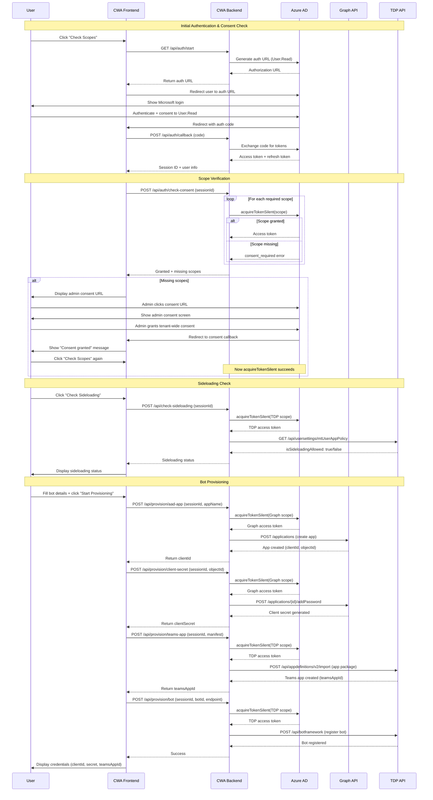

# Bot Provisioner - Technical Architecture

## System Participants

### CodeWriterApp (CWA)
The confidential client application that orchestrates bot provisioning. Runs as a web server with:
- **Backend**: Node.js server with MSAL confidential client (port 3003)
- **Frontend**: Static HTML/JS served via HTTP server (port 8080)
- **Registered in**: CWA's own Azure AD tenant
- **Multi-tenant**: Yes - can provision bots for any tenant that grants consent

### Azure AD (CWA Tenant)
The identity provider where CWA is registered as a multi-tenant application. Handles:
- OAuth authorization code flow for user authentication
- Token issuance for accessing Microsoft Graph and Teams Dev Portal
- Admin consent grants (tenant-wide permissions)

### User (User Tenant)
An end user from any Microsoft 365 tenant who wants to provision a bot. The user:
- Authenticates via OAuth to CWA
- Must have sufficient permissions to create apps in their tenant
- May need their tenant admin to grant consent for required permissions

### Teams Developer Portal Backend (TDP)
Microsoft's backend service for Teams app management (`https://dev.teams.microsoft.com`). Provides APIs for:
- Creating Teams app definitions
- Registering bot endpoints
- Checking tenant sideloading status
- **Requires**: `AppDefinitions.ReadWrite` scope

### Microsoft Graph Backend
Microsoft's unified API endpoint (`https://graph.microsoft.com`). Provides APIs for:
- Creating Azure AD app registrations
- Generating client secrets
- Managing app permissions
- **Requires**: `Application.ReadWrite.All` scope

## Requirements for Bot Provisioning

For CWA to successfully provision a Teams bot for a user, the following conditions must be met:

### 1. User Authentication
- User must authenticate with CWA using OAuth 2.0 authorization code flow
- Minimum scope: `User.Read` (always grantable by user)

### 2. Admin Consent
The user's tenant admin must grant consent for these delegated permissions:
- **Graph API**: `Application.ReadWrite.All` - Create Azure AD apps and secrets
- **Graph API**: `TeamsAppInstallation.ReadForUser` - Query installed Teams apps (optional)
- **Teams Dev Portal**: `AppDefinitions.ReadWrite` - Create Teams apps and register bots

### 3. User Permissions
The authenticated user must have roles in their tenant allowing:
- Creating app registrations in Azure AD (typically requires Application Administrator role)
- Creating Teams apps via Developer Portal

### 4. Tenant Settings
- **Sideloading**: Tenant must allow custom app uploads (verifiable via TDP API)
- **App Registration**: Tenant must allow users to register applications (Azure AD setting)

### 5. Bot Endpoint
- User must provide an HTTPS endpoint where the bot will be hosted
- Endpoint must be accessible from Microsoft Teams infrastructure

## Provisioning Flow

## Key Technical Details

### Token Acquisition Strategy
CWA uses a two-phase token acquisition approach:

1. **Initial auth**: Request only `User.Read` scope - this always succeeds, allowing users to sign in even without admin consent
2. **Subsequent requests**: Use `acquireTokenSilent()` with cached refresh token to obtain tokens for admin-consented scopes

This pattern avoids blocking users at sign-in while clearly indicating which permissions are missing.

### Multi-Resource Token Management
The provisioning flow requires tokens for two different resource servers:
- **Microsoft Graph**: For Azure AD app management
- **Teams Dev Portal**: For Teams app and bot management

Azure AD does not allow requesting scopes from multiple resources in a single auth request. CWA handles this by:
- Authenticating once with `User.Read`
- Using the cached refresh token to silently acquire tokens for each resource as needed

### Error Handling
When `acquireTokenSilent()` fails, CWA distinguishes between:
- **Expected**: `consent_required`, `interaction_required`, `invalid_grant` with AADSTS65001 → Show admin consent URL
- **Unexpected**: Network errors, token expiration, unknown errors → Return error to user

### Session Management
- Sessions stored in-memory on backend (Map keyed by sessionId)
- Frontend stores sessionId and userInfo in localStorage
- MSAL handles token caching internally
- Sessions lost on backend restart (in-memory only)
